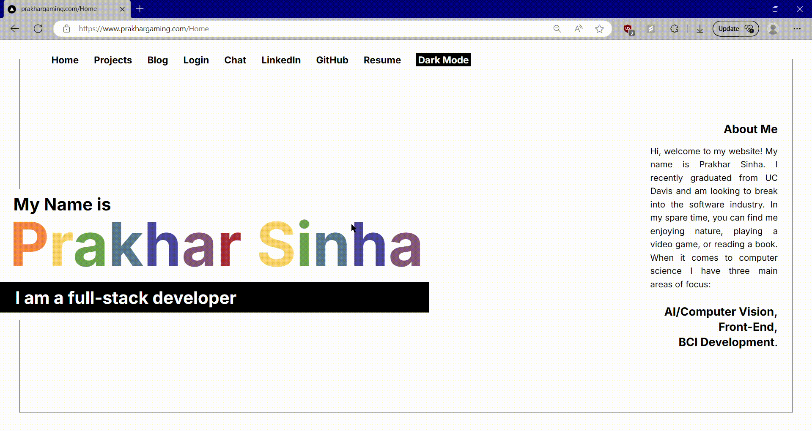

# [prakhargaming.com](https://www.prakhargaming.com)

[prakhargaming.com](https://www.prakhargaming.com) is my fully responsive and modern personal website that also serves as my portfolio. It started off as a dumb exercise in front-end development but it has evolved into a space that I use to test out and demonstrate my skills as a developer.

## Tech Stack

[prakhargaming.com](https://www.prakhargaming.com) is a completely uses a serverless architecture built with Next.js and is hosted on Vercel. This comes with its own set of challenges. Technologies used include:

- Frontend:
  - Next.js/React
  - Typescript
  - Tailwind CSS
- Backend:
  - Typescript/Node.js
  - MongoDB Atlas Database
  - Authentication with Clerk
  - Twilio Send-Grid for Automated Emails
  - Google Gemini API for LLM functionality

## Features

This website has a host of features to help people learn about my skills.

### Chat

This is the latest feature that I pushed to the site. PrakharGaming is a Retrieval Augmented Generation (RAG)-enabled LLM that runs off of `Google Gemini 2.0 Flash-Lite` and MongoDB Atlus Vector Search Index. It's the most comprehensive feature I've pushed so far. It's very modern, using a completely serverless architecture and modern AI API's to interact with the user. PrakharGaming answers questions regarding my professional background by using my resume and my Github repositories as context. Here are a few lessons I learned along the way:

- **Serverless is not the Future** Serverless is pretty cool and has its purposes. However, it is not a "one size fits all" solution. Being constrained by having to develop a stateless backend is a lot harder than you might think.
- **RAG is Powerful** With models' context windows getting bigger and bigger, people are saying RAG is dead. This is wrong. RAG is a powerful tool that helps models arrive at helpful answers with little overhead. This is especially true for smaller and lighter models.
- **Gemini is a very Frustrating Platform** I did not enjoy using Google Gemini to develop. The documentation is confusing and the distinction between Google AI Studio and the Vertex SDK is very thin and confusing. I ran into a lot of issues here.

### Blogs

Blogs are fetched from MongoDB Atlas and dynamically constructed per request. They used to all be hosted locally but for security reasons, I decided to store them on a proper database. Once the data is fetched, they are constructed using [`ReactMarkdown`](https://github.com/remarkjs/react-markdown). Pictures are supported as well, stored in `Base64`. This is my personal space to display my creative side. I have always loved writing and I'm glad I have a space to demonstrate that passion.

### Login

You can log on to my website using [Clerk](https://clerk.com/). This was mainly developed as a way to send automated emails using Twilio Sendgrid. This feature is rarely used but I would like to use it more somehow. Clerk is a great platform and I enjoyed developing with it.

### Projects

You can view all my projects by visiting the projects tab, this will take you to each project's respective GitHub link.

### Resume, Github, and LinkedIn

You can visit all of my professional profiles and download my resume here.

That's it! I encourage you to visit and let me know what you think! I take development pretty seriously and you can look at the issues, pull requests, and branches I've created as well. Thanks.
